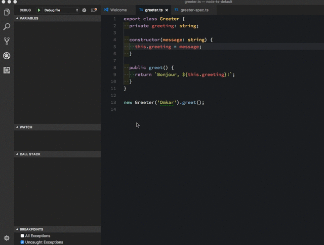

# TypeScript NodeJS Generator
[](https://travis-ci.org/ospatil/generator-node-typescript)
[](http://badge.fury.io/js/generator-node-typescript)

Bonjour! I'm a minimal [Yeoman](http://yeoman.io) generator for creating NodeJS packages using TypeScript. I let you quickly setup a project with latest available tools and best practices.

I use:

- _npm_ - as task runner.
- _jest_ - as [testing and coverage framework](https://facebook.github.io/jest/) to write specs in **TypeScript** itself. You can choose to use _mocha_ or _ava_ instead.

You want to know if you can change any of these? Of course, why not? It is your package after all. I simply get down to business of generating, no questions asked and then quiety get out of the way!

## Usage

Install `generator-node-typescript` globally.

```sh
$npm i -g generator-node-typescript
```

Create a new directory and `cd` into it.

```sh
$mkdir my-new-project && cd $_

```

Run the generator.

```sh
$yo node-typescript
```

You can choose to use _mocha_ as your test framework using command - `$yo node-typescript --mocha`

You can choose to use _ava_ as your test framework using command - `$yo node-typescript --ava`

Generate a new class and test file.

```sh
$yo node-typescript:classlib MyNewClass [--mocha | --ava]
```

## Highlights of the latest release

- I use latest version of **TypeScript**.
- I use [yarn](https://yarnpkg.com) in place of npm if it's available.
- I use _jest_ which is a "batteries-included" testing framework with coverage built-in (optionally _mocha_ or _ava_). **You write tests in TypeScript itself**.
- I use _prettier_ integrated with _tslint_ to provide no-fuss code formatting and linting.
- I need **no global dependencies**. Every dependency such as _TypeScript_ and _tslint_ is installed as local dev dependency allowing you to freely use different versions of these for different packages.

  ### Integration with VS Code
- I configure `build`, `clean`, `lint`, `coverage`, `format` and `test` tasks that you can run using `Run Task` option.
- You can directly run currently open source file using task `Run current file`. I use [ts-node](https://github.com/TypeStrong/ts-node) to provide this functionality.
- You can debug currently open source file using `Debug file` launch configuration. You can also debug currently open test file using `Debug test` launch configuration without the need of compiling it first. Here is the preview -

  

## License

MIT
